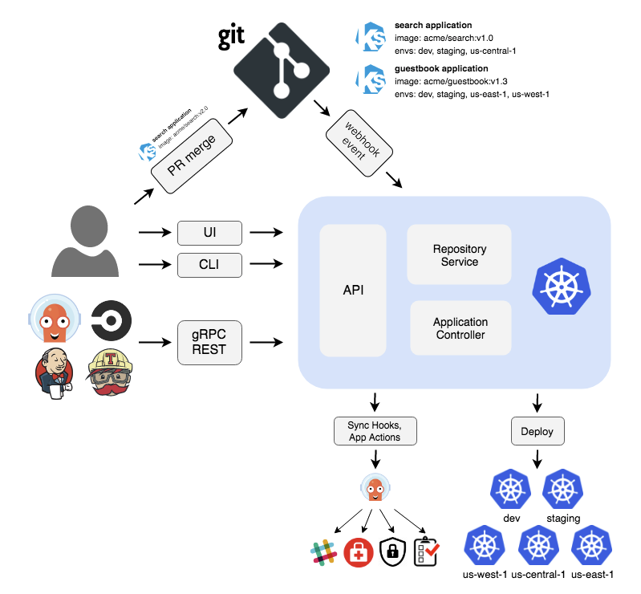
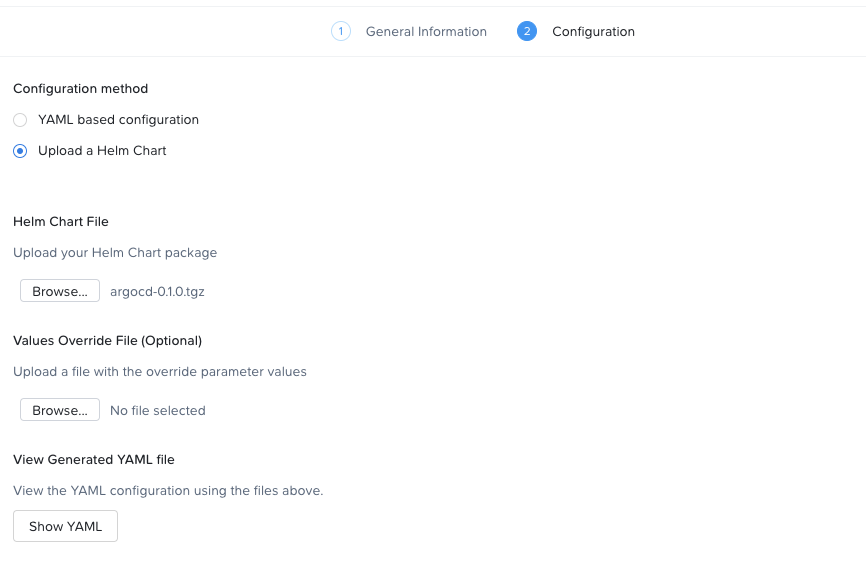
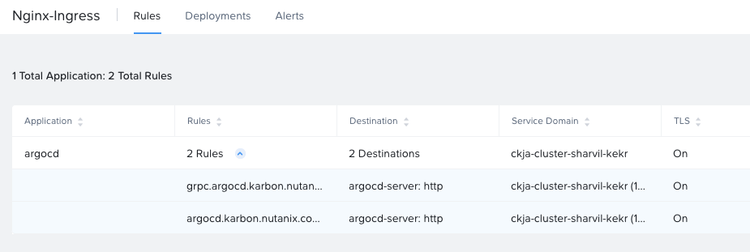
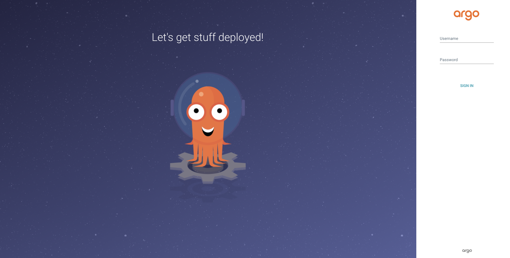
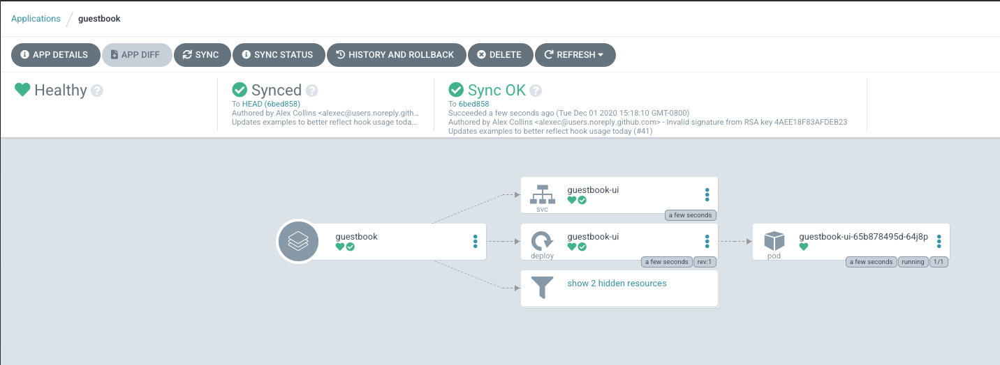

# ArgoCD with Karbon Platform Services

This guide will show you how to implement continuous deployment via ArgoCD on KPS.

## Deploy a Kubernetes Application on Karbon Platform Services

Karbon Platform Services (KPS) is a Kubernetes based multi-cloud PaaS that enables rapid development and deployment of microservices-based applications ranging from simple stateful containerized applications to complex AI, IoT and hybrid applications across any cloud.

This tutorial will guide you through the configuration of [ArgoCD](https://argoproj.github.io/argo-cd/) and setup of simple Continuous Deployment Pipeline for a sample application. You can use ArgoCD GUI or CLI to manage life cycle of Apps deployed on KPS Service Domain. This tutorial assumes your Service Domain has already been deployed using steps from the <a href="https://portal.nutanix.com/page/documents/details?targetId=Karbon-Platform-Services-Admin-Guide:ks-service-domain-manage-c.html">Karbon Platform Services Admin Guide</a> and that direct network connectivity between the Service Domain and your workstation is configured (to view sample web app output). Access to the Admin Guide is provided via the My Nutanix Portal and requires an account to login.

**For brevity, several component applications in this tutorial have been combined into single deployment manifests (Kubernetes YAML or Helm chart). This is not representative of a typical production deployment, where all applications and services are deployed as separate apps using API calls in a standard CI/CD pipeline.** 

## Accessing Karbon Platform Services
1. Open https://my.nutanix.com/ in your browser. If you don't already have a My Nutanix account, follow steps to create one.
1. Scroll to the Cloud Services section and click Launch to access the Karbon Platform Services Cloud Management Console.

   At this point you should have a dashboard with a default User (you), Project, Category.

## ArgoCD Architecture


### Creating a Project
In KPS, Projects are used to segment resources such as Kubernetes Apps and other services so that only assigned users can view and modify them. This allows different departments or teams to utilize shared Service Domains, or cloud resources without interfering with each other's applications or business logic.

As part of this tutorial, you’ll create a new Project to deploy your ArgoCD Application.

1. After logging into the Karbon Platform Services Cloud Management Console, proceed to the Projects section. 
1. Create a project, name it ArgoCD, add yourself as a User, and then click **Next**. 
1. On the Resources Assignment dialog, select the Service Domain you wish to run your application and click **Next**. 
   
   KPS has the ability to natively send to several public cloud services such as AWS S3, or GCP Cloud Datastore. For this tutorial, Cloud Profile Selection can be left blank because no cloud resources will be used.

   KPS can run Kubernetes Apps with images stored in public or private registries. Private registries can be accessed by creating a KPS Container Registry Profile to store required access information. Because this tutorial utilizes containers hosted in a public registry, Container Registry Selection can be left blank.
 
1. In the final section, enable **Nginx** and click **Create**.

### Enable Priviledged Mode

The following steps will show you how to enable priviledged mode on a KPS project:

1. Create an API Token in your KPS account
   * You will find a section labeled **Manage API Keys** under your username in the top right corner of the KPS UI
2. Use the following _curl_ command to obtain your project/user ID. Notice the variables labelled _id_ and _user.userID_ for the ArgoCD project.
```
curl -X GET --header 'Content-Type: application/json' --header 'Accept: application/json' --header 'Authorization: Bearer <API Token>' https://<KPS URL>/v1.0/projects
```
3. Use the following curl command to enable priviledged mode on the ArgoCD project.
```
curl -X PUT --header 'Content-Type: application/json' --header 'Accept: application/json' --header 'Authorization: Bearer <API Token>' -d '{ \
   "name": "v1", \
   "description": "v1", \
   "cloudCredentialIds": [], \
   "dockerProfileIds": [], \
   "users": [ \
     { \
       "userId": "<user_id>", \
       "role": "PROJECT_ADMIN" \
     } \
   ], \
   "edgeSelectorType": "Explicit", \
   "edgeSelectors": null, \
   "privileged": true \
 }' 'https://<KPS URL>/v1.0/projects/<project_id>'
 ```

### Application Helm Chart

In this section, you will be uploading a Helm chart that will deploy the ArgoCD application.

1. In a new browser tab or window, download the compressed tar file labeled <a href="argocd-0.1.0.tgz" download>argocd-0.1.0.tgz</a>. This file contains a Helm chart for the ArgoCD application.
1. Switch context to ArgoCD in the Project pulldown, then click **Kubernetes Apps**.
1. Create a new Kubernetes App and name it __argocd__. In the Service Domain Selection section, be sure to choose the same Service Domain you selected for the project, then click **Next**. 

   

1. On the Configuration dialog, upload the woodkraft-apps tar file downloaded earlier as a Helm chart. Select **Show YAML** for a look at the sample configurations, then click **Create**.

#### Verify Nginx

1. Browse to the Nginx section in the UI to confirm new ingress rules were created.

   

### Accessing the Applications

1. Create a new DNS records that map the hostnames and IP addresses used in the **argocd.karbon.nutanix.com** Nginx rule created above. For simplicity, on your local workstation, add the hostnames to the **/etc/hosts** file.

#### MacOS/Linux
```
echo "<Service Domain IP> argocd.karbon.nutanix.com" | sudo tee -a /etc/hosts
```

#### Windows
```
echo <Service Domain IP> argocd.karbon.nutanix.com >> %WINDIR%\System32\Drivers\Etc\Hosts
```

### ArgoCD UI

Visit [argocd.karbon.nutanix.com](https://argocd.karbon.nutanix.com/) and confirm that the application is working successfully. 



#### ArgoCD Login

The username for ArgoCD is _admin_, but the password is different for each user. You can retrieve the password with the following steps:
1. Navigate to the _argocd_ application and select **Log Bundles**
1. Choose **Run Log Collector** and select the service domain in use
1. When the log collector finished running, download the log bundle.
1. Navigate to the _pods_ directory under the project namespace
1. You will see a directory in the format _argocd-server-ID_. The password for the ArgoCD application in the full name of the argo server directory.
   * username: _admin_
   * password: _argocd-server-ID_
**Note:** We recommend saving the password or changing it upon first login to something easier to remember.

#### ArgoCD App

Next a new application will be setup with continuous deployment on ArgoCD. Use the following steps to set up 
the sample application.

1. Select **New App**
1. Fill in the following fields:
   * Application name: _guestbook_
   * Project: _default_
   * Sync Policy: _Manual_
   * Repository URL: _https://github.com/argoproj/argocd-example-apps.git_
   * Revision: _HEAD_
   * Path: _guestbook_
   * Cluster URL: _https://kubernetes.default.svc_
   * Namespace: _default_
1. Choose **Sync** to sync your app with the git server
1. The app should now be set up with continuous deployment.



Congratulations, you have created a continuous deployment pipeline with ArgoCD on Karbon Platform Services!

## Takeaways

* Creating projects with Karbon Platform Services segments resources such as Kubernetes Apps and other services so that only assigned users can view and modify them.
* KSP enables management of application services such as Nginx from one platform.
* Kubernetes applications can be created using Kubernets formatted YAML or Helm charts in KPS.
* Configuring and confirming ingress rules to deployed Kubernetes applications is easy in KPS.
* Simplicity of creating continuous deployment pipelines in KPS with frameworks like ArgoCD.