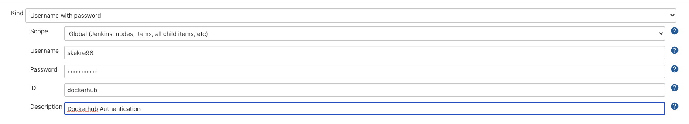
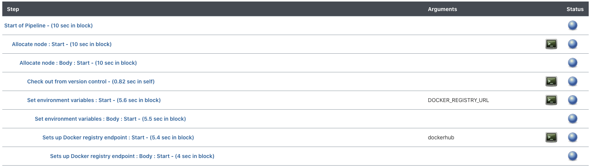

# Jenkins with Karbon Platform Services

This guide will show you how to implement a CI/CD pipeline in Jenkins with KPS.


## Setup

You will start by setting up your environment. This guides assumes you already have a Jenkins environment set up.

1. Install [CloudBees Docker Build/Publish](https://plugins.jenkins.io/docker-build-publish/) and [Python](https://plugins.jenkins.io/python/#documentation) Jenkins Plugins.
2. Create an API Token in your KPS account
    * You will find a section labeled **Manage API Keys** under your username in the top right corner of the KPS UI
3. In Jenkins, head to **Manage Jenkins** -> **Manage Credentials** -> **Global credentials (unrestricted)** -> **Add Credentials** and add your Dockerhub credentials with the label _dockerhub_.

4. Next, head to **Manage Jenkins** -> **Configure System** and add your KPS API Token as an environment variable.
    * Label the variable **TOKEN** otherwise you can change the variable in the Jenkinsfile to your unique name.
5. Create a Docker Hub repository for you application.

**Note**: This example will be using Docker Hub as a container registry, but this framework can be used with any container registry.

## CI/CD Pipeline

This section will take a deep dive into the different steps being used in the CI/CD pipeline. These steps have been configured in [Jenkinsfile](Jenkinsfile).The Jenkinsfile 
will be performing a few simple tasks which include set up, build/push, and deployment.

**Note**: Make sure you define the Jenkins pipeline with **Pipeline script from SCM** so it knows to look for the Jenkinsfile in the git repository.

### Setup

The following portion of the Jenkinsfile is used to checkout the git repository and set up environment variables.
```java
checkout scm
// Environment variables 
def kps_url = "https://sharvilkkr.ntnxsherlock.com/"
def kps_token = "${env.TOKEN}"
def kps_project = "Cat Dog"
def app = "cat-dog"
```
Make sure to update `${env.TOKEN}` with the same name you had configured earlier.

### Build/Push

The following is a job configured to build the cat-dog image and push it to your Dockerhub repository.
```java
docker.withRegistry('https://registry.hub.docker.com', 'dockerhub') {

    def customImage = docker.build("<dockerhub username>/cat-dog")

    /* Push the container to the custom registry */
    customImage.push()
}
```
This job will be using the Docker Hub credentials you set up earlier.

### Deploy

The following job is configured to deploy the recently built application to KPS.
```java
// Deploy to Karbon Platform Services
sh 'pip install requests'
sh "python manage.py -u ${kps_url} -p \"${kps_project}\" -t ${kps_token} -a ${app}"
```
At a high level, this job will be taking the deployment yaml and creating or updating the application in KPS with API calls. You can 
find how the API calls are being made by refering to [manage.py](../manage.py)

## Using the Pipeline

You can select **Build Now** which will checkout the git repository in its current state and trigger the CI/CD pipeline. You can view 
the progress of your pipeline by selecting the build number then **Pipeline Steps** or **Console Output**.


## Takeaways

* How to configure a Jenkinsfile for a Pipeline
* Configuring environment variables in a Jenkins Pipeline
* How to configure a Jenkins CI job
* How to trigger a Jenkins CI/CD pipeline
* Using the KPS API to run a Jenkins deployment job