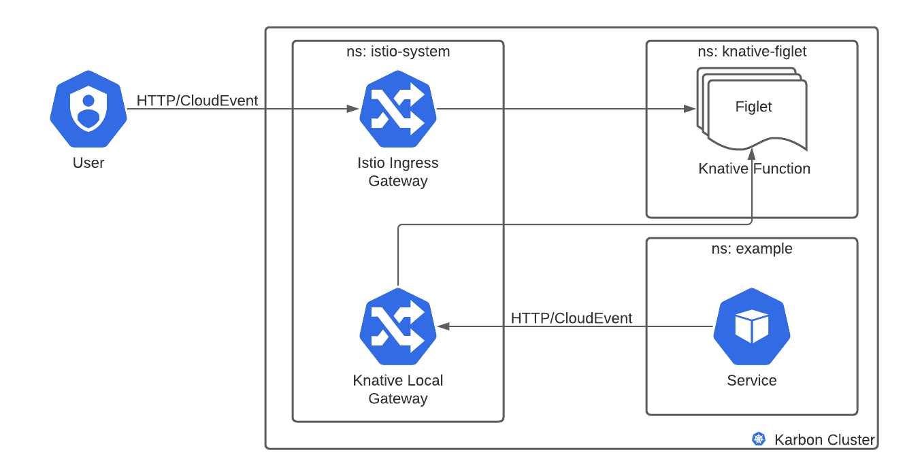

# Knative on Nutanix Karbon 

# Overview
This guide describes how to deploy and use Knative on Nutanix Karbon. Once you finish deployment, you will be able to do the following.

* Manage a running Kubernetes cluster with Knative components installed.
* Use kubectl to create Knative services and pipelines.

# Prerequisites

1. [Install Terraform](https://learn.hashicorp.com/tutorials/terraform/install-cli)
2. [Install kubectl](https://kubernetes.io/docs/tasks/tools/#kubectl)
2. [Install helm](https://helm.sh/docs/intro/install/)


# Nutanix Karbon Cluster

## Create a Cluster
At the Nutanix Support portal, see the Nutanix Karbon topic [Creating a Cluster](https://portal.nutanix.com/page/documents/details?targetId=Karbon-v2_2:kar-karbon-deploy-karbon-t.html).

### Requirements
For prototyping purposes, Knative will work on most local deployments of Kubernetes. For example, you can use a local, one-node cluster that has 2 CPUs and 4GB of memory.
For production purposes, knative recommends:
* If you have only one node in your cluster, you will need at least 6 CPUs, 6 GB of memory, and 30 GB of disk storage.
* If you have multiple nodes in your cluster, for each node you will need at least 2 CPUs, 4 GB of memory, and 20 GB of disk storage.


# Setup a Load balancer (Optional)
If you already have a load balancer set up for your Karbon cluster, you can skip this step.  \
If not, you can install the [MetalLB](https://metallb.universe.tf/) load balancer manifests.
```
$ kubectl apply -f https://raw.githubusercontent.com/metallb/metallb/v0.10.2/manifests/namespace.yaml

$ kubectl apply -f https://raw.githubusercontent.com/metallb/metallb/v0.10.2/manifests/metallb.yaml
```

After the manifests have been applied, we need to configure MetalLB with the IP range that it can use to assign external IPs to services of type LoadBalancer. You can find the range from the subnet in Prism Central’s networking settings.
```
apiVersion: v1
kind: ConfigMap
metadata:
  namespace: metallb-system
  name: config
data:
  config: |
    address-pools:
      - name: default
        protocol: layer2
        addresses:
        - x.x.x.x-x.x.x.x
```

Create a ConfigMap with the following information, substitute the addresses field with your IP address range, and apply it to the cluster.
```
$ kubectl apply -f metallb-configmap.yaml
```

# Install Knative on Karbon Clusters
1. To deploy Knative, clone this Github repository to download the Terraform script.
```
$ git clone https://github.com/nutanix/karbon-platform-services.git
$ cd automation/infrastructure/terraform/kcs/install_knative
```

2. Update the terraform `variables.tf` file or create a `env.tfvars` file with the values.
```
prism_central_username = "enter username"
prism_central_password = "enter password"
prism_central_endpoint = "enter endpoint_ip_or_host_fqdn"
karbon_cluster_name    = "enter karbon_cluster_name"
kubeconfig_filename    = "enter karbon_cluster_name-kubectl.cfg"
knative_version        = "0.25.0"
```

3. Run these terraform commands to deploy Knative in the cluster.
```
$ terraform init
$ terraform plan --var-file=env.tfvars
$ terraform apply --var-file=env.tfvars
```

## Check your Deployment
1. Check for istio-system, knative-serving, and knative-eventing namespaces.
```
$ kubectl get ns
NAME                   STATUS   AGE
default                Active   29d
istio-system           Active   105m
knative-eventing       Active   106m
knative-serving        Active   104m
kube-node-lease        Active   29d
kube-public            Active   29d
kube-system            Active   29d
kubernetes-dashboard   Active   29d
metrics                Active   29d
ntnx-system            Active   29d
project-ingress        Active   29d
```

```
$ kubectl -n knative-serving get all
NAME                                    READY   STATUS    RESTARTS   AGE
pod/activator-799bbf59dc-ldrpr          1/1     Running   0          110m
pod/autoscaler-75895c6c95-wp5cc         1/1     Running   0          110m
pod/controller-57956677cf-44q68         1/1     Running   0          110m
pod/istio-webhook-5f876d5c85-wv94b      1/1     Running   0          109m
pod/networking-istio-6bbc6b9664-tb85p   1/1     Running   0          109m
pod/webhook-ff79fddb7-rxvdz             1/1     Running   0          110m

NAME                                 TYPE        CLUSTER-IP       EXTERNAL-IP   PORT(S)                           AGE
service/activator-service            ClusterIP   172.19.62.37     <none>        9090/TCP,8008/TCP,80/TCP,81/TCP   110m
service/autoscaler                   ClusterIP   172.19.197.180   <none>        9090/TCP,8008/TCP,8080/TCP        110m
service/autoscaler-bucket-00-of-01   ClusterIP   172.19.104.46    <none>        8080/TCP                          110m
service/controller                   ClusterIP   172.19.211.242   <none>        9090/TCP,8008/TCP                 110m
service/istio-webhook                ClusterIP   172.19.92.154    <none>        9090/TCP,8008/TCP,443/TCP         109m
service/webhook                      ClusterIP   172.19.91.6      <none>        9090/TCP,8008/TCP,443/TCP         110m

NAME                               READY   UP-TO-DATE   AVAILABLE   AGE
deployment.apps/activator          1/1     1            1           110m
deployment.apps/autoscaler         1/1     1            1           110m
deployment.apps/controller         1/1     1            1           110m
deployment.apps/istio-webhook      1/1     1            1           109m
deployment.apps/networking-istio   1/1     1            1           109m
deployment.apps/webhook            1/1     1            1           110m

NAME                                          DESIRED   CURRENT   READY   AGE
replicaset.apps/activator-799bbf59dc          1         1         1       110m
replicaset.apps/autoscaler-75895c6c95         1         1         1       110m
replicaset.apps/controller-57956677cf         1         1         1       110m
replicaset.apps/istio-webhook-5f876d5c85      1         1         1       109m
replicaset.apps/networking-istio-6bbc6b9664   1         1         1       109m
replicaset.apps/webhook-ff79fddb7             1         1         1       110m

NAME                                            REFERENCE              TARGETS          MINPODS   MAXPODS   REPLICAS   AGE
horizontalpodautoscaler.autoscaling/activator   Deployment/activator   <unknown>/100%   1         20        1          110m
horizontalpodautoscaler.autoscaling/webhook     Deployment/webhook     <unknown>/100%   1         5         1          110m
```

```
$ kubectl -n knative-eventing get all
NAME                                         READY   STATUS    RESTARTS   AGE
pod/eventing-controller-674d4785c-nqbpj      1/1     Running   2          113m
pod/eventing-webhook-55d56cc446-j9c2d        1/1     Running   2          113m
pod/imc-controller-748bf845c7-2nbjx          1/1     Running   0          113m
pod/imc-dispatcher-56559cd47-wtfjr           1/1     Running   0          113m
pod/mt-broker-controller-6f6c8dd95f-5vwk4    1/1     Running   0          112m
pod/mt-broker-filter-574bf6f5f8-mvztr        1/1     Running   0          112m
pod/mt-broker-ingress-749cc5cc5-w44cm        1/1     Running   0          112m
pod/pingsource-mt-adapter-5c7944bd54-zlxpn   1/1     Running   0          96m

NAME                       TYPE        CLUSTER-IP       EXTERNAL-IP   PORT(S)           AGE
service/broker-filter      ClusterIP   172.19.239.252   <none>        80/TCP,9092/TCP   112m
service/broker-ingress     ClusterIP   172.19.165.244   <none>        80/TCP,9092/TCP   112m
service/eventing-webhook   ClusterIP   172.19.195.132   <none>        443/TCP           113m
service/imc-dispatcher     ClusterIP   172.19.21.159    <none>        80/TCP            113m

NAME                                    READY   UP-TO-DATE   AVAILABLE   AGE
deployment.apps/eventing-controller     1/1     1            1           113m
deployment.apps/eventing-webhook        1/1     1            1           113m
deployment.apps/imc-controller          1/1     1            1           113m
deployment.apps/imc-dispatcher          1/1     1            1           113m
deployment.apps/mt-broker-controller    1/1     1            1           112m
deployment.apps/mt-broker-filter        1/1     1            1           112m
deployment.apps/mt-broker-ingress       1/1     1            1           112m
deployment.apps/pingsource-mt-adapter   1/1     1            1           113m

NAME                                               DESIRED   CURRENT   READY   AGE
replicaset.apps/eventing-controller-674d4785c      1         1         1       113m
replicaset.apps/eventing-webhook-55d56cc446        1         1         1       113m
replicaset.apps/imc-controller-748bf845c7          1         1         1       113m
replicaset.apps/imc-dispatcher-56559cd47           1         1         1       113m
replicaset.apps/mt-broker-controller-6f6c8dd95f    1         1         1       112m
replicaset.apps/mt-broker-filter-574bf6f5f8        1         1         1       112m
replicaset.apps/mt-broker-ingress-749cc5cc5        1         1         1       112m
replicaset.apps/pingsource-mt-adapter-5c7944bd54   1         1         1       96m
replicaset.apps/pingsource-mt-adapter-64f49dcf46   0         0         0       113m

NAME                                                     REFERENCE                      TARGETS          MINPODS   MAXPODS   REPLICAS   AGE
horizontalpodautoscaler.autoscaling/broker-filter-hpa    Deployment/mt-broker-filter    <unknown>/70%    1         10        1          112m
horizontalpodautoscaler.autoscaling/broker-ingress-hpa   Deployment/mt-broker-ingress   <unknown>/70%    1         10        1          112m
horizontalpodautoscaler.autoscaling/eventing-webhook     Deployment/eventing-webhook    <unknown>/100%   1         5         1          113m
```

```
$ kubectl -n istio-system get all
NAME                                        READY   STATUS    RESTARTS   AGE
pod/istio-ingressgateway-564b5ffdf7-8n4ms   1/1     Running   0          113m
pod/istio-ingressgateway-564b5ffdf7-cxsqf   1/1     Running   0          113m
pod/istio-ingressgateway-564b5ffdf7-l69cn   1/1     Running   0          113m
pod/istiod-7b688587d8-p7wvn                 1/1     Running   0          113m
pod/istiod-7b688587d8-pkhtn                 1/1     Running   2          113m
pod/istiod-7b688587d8-qbq9b                 1/1     Running   0          113m

NAME                            TYPE           CLUSTER-IP       EXTERNAL-IP   PORT(S)                                                                      AGE
service/istio-ingressgateway    LoadBalancer   172.19.236.233   <pending>     15021:31905/TCP,80:30138/TCP,443:30923/TCP,15012:31646/TCP,15443:30121/TCP   113m
service/istiod                  ClusterIP      172.19.234.198   <none>        15010/TCP,15012/TCP,443/TCP,15014/TCP                                        113m
service/knative-local-gateway   ClusterIP      172.19.220.185   <none>        80/TCP                                                                       113m

NAME                                   READY   UP-TO-DATE   AVAILABLE   AGE
deployment.apps/istio-ingressgateway   3/3     3            3           113m
deployment.apps/istiod                 3/3     3            3           113m

NAME                                              DESIRED   CURRENT   READY   AGE
replicaset.apps/istio-ingressgateway-564b5ffdf7   3         3         3       113m
replicaset.apps/istiod-7b688587d8                 3         3         3       113m

NAME                                         REFERENCE           TARGETS         MINPODS   MAXPODS   REPLICAS   AGE
horizontalpodautoscaler.autoscaling/istiod   Deployment/istiod   <unknown>/60%   3         10        3          113m
```

## Setup Monitoring

Knative relies on OpenTelemetry for instrumenting, generating, collecting, and exporting metrics. Prometheus can scrape the [OpenTelemetry collector](https://opentelemetry.io/docs/collector/) for collecting metrics for [eventing](https://knative.dev/docs/admin/collecting-metrics/eventing-metrics/metrics/) and [serving](https://knative.dev/docs/admin/collecting-metrics/serving-metrics/metrics/) components. This is installed during Terraform provisioning.


# Using Knative

## Example: Event driven service

You can find the manifest for this example [here](https://github.com/nutanix/karbon-platform-services/tree/master/applications/knative/simple). Apply the manifest file to create the knative service and event source.


This example creates a knative serving service to print
any CloudEvents it receives from the source. An API resource sends API events in the namespace to a channel and a subscription is created from the channel to the fn
Service. 


```
$ kubectl apply -f example.yaml
```

See the logs of ``fn`` pod in the ``knative-simple`` namespace to see the events from the event source getting printed on STDOUT.

## Example: Sequence

You can find the manifest for this example [here](https://github.com/nutanix/karbon-platform-services/tree/master/applications/knative/sequence). Apply the manifest file to create the knative services, channels, routes, subscriptions, and event source.


This example creates a sequence pipeline of 3 transformations to transform the
incoming event created by PingSource every minute to append information to the event. After the event is transformed it is routed to the eventdisplay service to be displayed. All the data movement between source, transformations, and eventdisplay happens through channels. Creating a sequence automatically creates underlying channels, routes, and subscriptions.

```
$ kubectl apply -f sequence/example.yaml
```

See the logs of ``eventdisplay`` pod in the ``knative-sequence`` namespace to see the events

## Example: FaaS
This example creates a Golang function and deploys the function to the Karbon cluster. This function shows a simple example of HTTP based FaaS use case by handling GET & POST requests. The function will automatically scale to 0 when not in use for a period of time and will autoscale based on request load.
In order to work with the FaaS example, you will need the `func` CLI. The func CLI uses standard kubeconfig to interface with the Karbon cluster. It can be used independently using `func` or as a plugin to the `kn` CLI using `kn func`.

- For Linux
```
$ curl -L -o - func.gz https://github.com/knative-sandbox/kn-plugin-func/releases/latest/download/func_linux_amd64.gz | gunzip > func && chmod 755 func
```
- For Mac
```
$ curl -L -o - func.gz https://github.com/knative-sandbox/kn-plugin-func/releases/latest/download/func_darwin_amd64.gz | gunzip > func && chmod 755 func
```

Once the binary is downloaded, move the binary so it is installed to a location within your $PATH

```
$ mv func /usr/local/bin
```
Make sure your local docker is logged in to your docker registry.
Typically, this will log you in to docker hub if you
omit <registry.url>. If you are using a registry
other than Docker hub, provide that for `<registry.url>`

```
$ docker login -u developer -p [redacted] <registry.url>
```

You can find the example code to run [here](https://github.com/nutanix-xi/sherlock-developer/tree/master/applications/knative/function/figlet). The template for the figlet function above was generated using func CLI. If you wish to create a new function, you can do so using:

```
$ func create -l go function_name
```

Make sure the `image` property in `func.yaml` is pointing to your docker registry. To build the image locally you can run:

```
$ func build
```

To test and run the image locally you can run:

```
$ func run
```

To deploy the function on your Karbon cluster, you can run:
```
$ func deploy
```

You can now execute the function by curling your istio-ingressgateway IP address. Here, `figlet` is the name of the function and `figlet-knative` is the name of the namespace (see func.yaml).

```
$ curl <istio-ingressgateway-ip>:80 -H "Host: figlet.knative-figlet.example.com" -H "Content-Type: application/json" -d '{"text":"faas"}'
___  .    _    .    _    .  ___
| __| .   /_\   .   /_\   . / __|
| _|  .  / _ \  .  / _ \  . \__ \
|_|   . /_/ \_\ . /_/ \_\ . |___/
.         .         .
```



All external traffic must be routed through the Istio ingress gateway and all internal traffic can be routed through the knative local gateway.

# Uninstall 
To uninstall knative on Karbon, run the following command.

```
$ terraform destroy -var-file=env.tfvars
```
