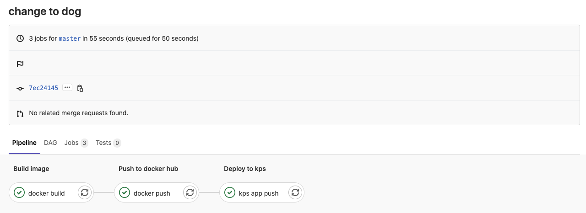

# Gitlab with Karbon Platform Services

This guide will show you how to implement a CI/CD pipeline in Gitlab with KPS.


## Setup

You will start by setting up your environment. This guide assumes you already have a gitlab repository set up.

1. Install [Docker](https://www.docker.com/) on your local machine.
2. Create an API Token in your KPS account
    * You will find a section labeled **Manage API Keys** under your username in the top right corner of the KPS UI
3. Set up a Python and Docker Runner in your Gitlab project.
    * Follow this [guide](https://angristan.xyz/2018/09/build-push-docker-images-gitlab-ci/) on how to set up your Runners
4. Create environment variables in your Gitlab project at **Settings** -> **CI/CD** -> **Variables**.
    * Create a variable called **REGISTRY_USER** which will refer to your container registry username
    * Create a variable called **REGISTRY_PASS** which will refer to your container registry password
    * Create a variable called **TOKEN** which will refer to your KPS API Token

**Note**: This example will be using Dockerhub as a container registry, but this framework can be used with any container registry.

## CI/CD Pipeline

This section will take a deep dive into the different steps being used in the CI/CD pipeline. These steps have been configured in [.gitlab-ci.yml](.gitlab-ci.yml).

### Build

The following is a job configured to build the cat-dog image.
```yaml
docker build:
  image: $DOCKER_RUNNER
  stage: Build image
  tags: 
  - docker
  only:
  - master
  script:
  - docker build -t registry.hub.docker.com/$REGISTRY_USER/$app .
  - docker tag registry.hub.docker.com/$REGISTRY_USER/$app:latest $REGISTRY_USER/$app:$VERSION
```

There are a few labels to note in this job. The first is __tag__ which lets the project runners know who is meant to pick up the job. The __only__ label
is used to signify which branches this job should be triggered on. Finally, __script__ signifies the commands that are to be executed inside the docker container.

### Push

The following is a job configured to push the cat-dog container to the container registry.
```yaml
docker push:
  image: $DOCKER_RUNNER
  stage: Push to Docker Hub
  tags: 
  - docker
  only:
  - master
  script:
  - docker login -u "$REGISTRY_USER" -p "$REGISTRY_PASS"
  - docker push $REGISTRY_USER/$app:$VERSION
```

The labels in this job are similar to the previous step. The script is logging into and then pushing to 
the specified container registry.

### Deploy

The following job is configured to deploy the recently built application to KPS.
```yaml
  image: $PYTHON_RUNNER
  stage: Deploy to KPS
  tags:
  - python
  only:
  - master
  script:
  - pip3 install requests
  - python3 manage.py -u $KPS_CLUSTER_URL -p "$KPS_PROJECT" -t $KPS_TOKEN -a "$app"
  allow_failure: true
```

Notice the new label in this job which tags the commands for the python runner. This script also allows for failure because the KPS API may return an error 
we would like to log. At a high level, this job will be taking the deployment yaml and creating or updating the application in KPS with API calls. You can 
find how the API calls are being made by refering to [manage.py](manage.py)

## Using the Pipeline

When you merge a change into the branches you have tagged in your CI yaml, the pipeline will trigger the jobs 
that have been specified. You can view the results and logs of these jobs at **CI/CD** -> **Pipelines**. You can view the logs of the job to debug
failures in the pipeline.


## Takeaways

* How to set up Runners in a Gitlab project
* Configuring environment variables in a Gitlab Project
* How to configure a Gitlab CI job
* How to trigger a Gitlab CI/CD pipeline
* Using the KPS API to run a deployment job