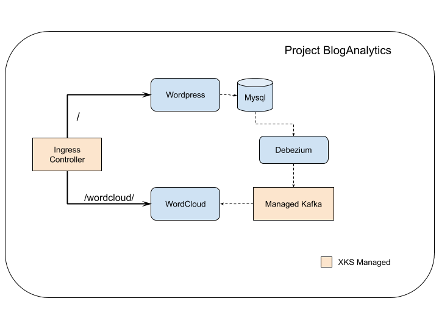

This series will guide users through adding a demo application to XKS Platform. Here we will create an application using opensource components and services provided by XKS, which will enable users to migrate existing apps to XKS and also give them an introduction to using XKS managed services

We will showcase the following services provided by XKS
* Ingress Controller
* Kafka
* Prometheus
* Istio

This series requires that you are familiar with basic navigation of XKS UI and with CLI. Please refer to the [Admin Guide](https://portal.nutanix.com/page/documents/details/?targetId=Xi-IoT-Infra-Admin-Guide:Xi-IoT-Infra-Admin-Guide) for more details.

# Application Design
To start with lets define the application we want to create. We have a typical content management system where users can post blogs, articles and others can add comments to it. We will also add some analytics behind it like a wordcloud which will tell the author what are the most popular terms in the reviews for their posts. 

Here are components we will use to build the application:

* Wordpress as the content management engine
* MySQL database to support Wordpress
* Debezium for getting change events from DB to Kafka
* Kafka for streaming the comments to some analysis process like WordCloud
* WordCloud receives the streams and updates the WordCloud

## Architecture



[Part 1](Part1/) We will cover installing wordpress configured with TLS ingress

[Part 2](Part2/README.md) We will add debezium and kafka to the project. We will also install tagCloud service which will then stream from the Kafka topic and update the tagCloud.

<!--
[Part 3](Part3/README.md) Here we will add Prometheus to monitor the application.

[Part 4](Part3/README.md) Finally we will add Istio to enable application telemetry.
-->

# Install prerequisites
These are the prerequites required to follow the instructions in this document. Please follow the links provided to install them:
* [Install Helm](https://helm.sh/docs/intro/install/)
* [Install kps CLI](https://github.com/nutanix/xi-iot/tree/master/cli)
* Install curl

## Setup kps CLI
From your terminal window, create a Karbon Platform Services context to associate with an existing Karbon Platform Services user.
```
$ kps config create-context context_name --email user_email_address --password password
```

* context_name. A context name to associate with the specified user_email_address and related Karbon Platform Services resources.
* user_email_address. Email address of an existing Karbon Platform Services user. This email address can be a My Nutanix account address or local user address.
* password. Password for the Karbon Platform Services user.

Verify that the context is created and the current context is the one that was created above
```
$ kps config get-contexts
```

## Setup Project
Details of registering Service Domains and adding them to a project are beyond the scope of this document. Please refer to the [Admin Guide]()
In this series we will assume that you have a project named *Blog Analytics* with atleast one Service Domain. 

## Add bitnami repo
Lastly, since many of the helm charts used in the document are stored in custom helm repos, so we will add them to the workspace.
```
 helm repo add bitnami https://charts.bitnami.com/bitnami
 ```
