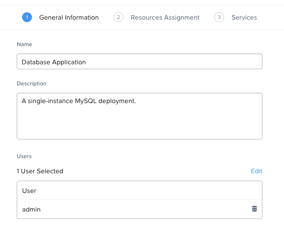
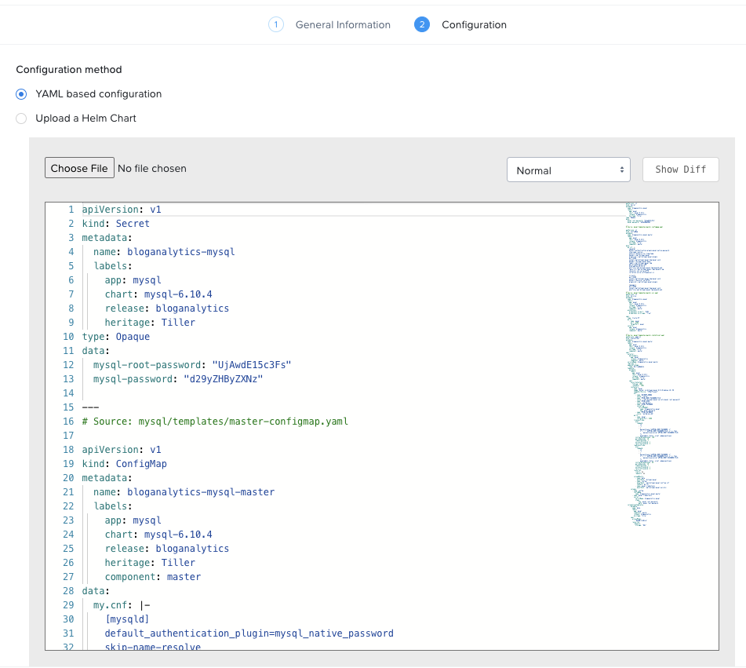
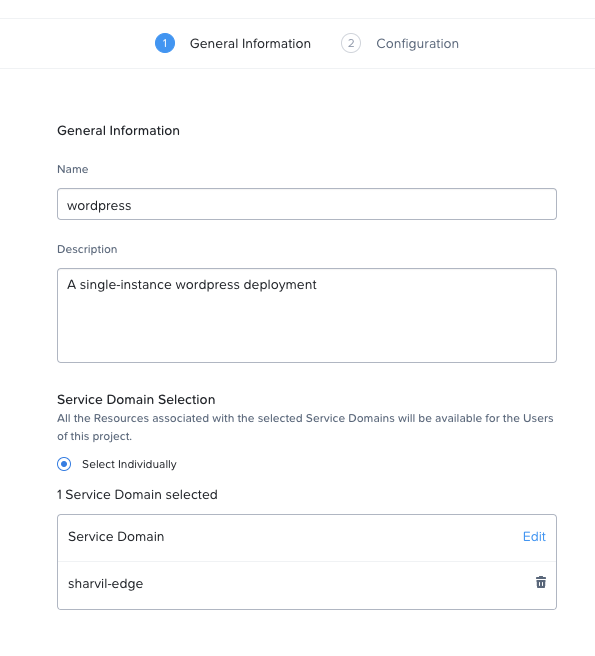
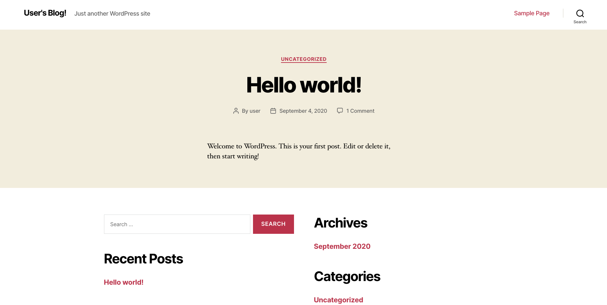

# Deploy a Stateful MySQL Application on Karbon Platform Services

Karbon Platform Services (KPS) is a Kubernetes based multi-cloud PaaS that enables rapid development and deployment of microservices-based applications ranging from simple stateful containerized applications to complex AI, IoT and hybrid applications across any cloud.

This tutorial will guide you through the deployment of a sample stateful Kubernetes Application utilizing the Nutanix CSI Volume Driver and Multinode Service Domain on KPS. This tutorial assumes your Multinode Service Domain has already been deployed using steps from the <a href="https://portal.nutanix.com/#/page/docs/details?targetId=Karbon-Platform-Services-Admin-Guide:ks-service-domain-multinode-c.html">Karbon Platform Services Admin Guide</a> and that direct network connectivity between the Service Domain and your workstation is configured (to view sample web app output). Access to the Admin Guide is provided via the My Nutanix Portal and requires an account to login.

## Nutanix CSI Volume Driver Overview

The Container Storage Interface (CSI) Volume Driver for Kubernetes utilized by KPS uses Nutanix Volumes to provide scalable, persistent storage for stateful applications.

Kubernetes is an open-source platform that orchestrates the deployment, scaling, and operations of application containers across host clusters. KPS Service Domains are deployed as Nutanix-hosted VMs and comprise a cluster.

Kubernetes contains an in-tree CSI Volume Plug-In that allows the out-of-tree Nutanix CSI Volume Driver to gain access to containers and provide persistent-volume storage. The plug-in runs in a pod and dynamically provisions requested PersistentVolumes (PVs) using Nutanix Volumes storage.

## Accessing Karbon Platform Services

1. Open https://my.nutanix.com/ in your browser. If you don't already have a My Nutanix account, follow steps to create one.
1. Scroll to the Cloud Services section and click Launch to access the Karbon Platform Services Cloud Management Console.

   At this point you should have a dashboard with a default User (you), Project, Category.

## Objectives

* Create PersistentVolumes and PersistentVolumeClaims automatically on a Multinode Service Domain's shared Nutanix Volume
* Configure
    * MySQL resources
    * Wordpress resources
* Deploy on Karbon Platform Services

## Create PersistentVolumes and PersistentVolumeClaims 

MySQL and Wordpress each require a PersistentVolume (PV) to store data. Their PersistentVolumeClaims (PVCs) will be created and a PersistentVolume dynamically provisioned during the app deployment phase. KPS Multinode Service Domains have the Kubernetes cluster default StorageClass configured to utilize the Nutanix Storage Container specified when creating the Multinode Service Domain. This saves administrators the steps required to manually configure the CSI Volume Driver and other Kubernetes components. In this tutorial, a specific StorageClass is not specified in the MySQL Statefulset's volumeClaimTemplates and in the Wordpress app's PersistentVolumeClaim, so the the Service Domain's default StorageClass (AOS Container) is used for both. 

You can find more information regarding managing PersistentVolumeClaims on Nutanix Volumes <a href="https://portal.nutanix.com/page/documents/details?targetId=CSI-Volume-Driver-v2_1:csi-csi-plugin-create-volume-claim-t.html">here</a>.

## Configure Resources

This section will show you how to configure your resources with persistent volumes. 

### MySQL

This YAML below describes an single-instance of a MySQL deployment. 
* Notice the *StatefulSet* configuration and the *volumeClaimTemplates*.

<details>
  <summary>Click to expand mysql.yaml</summary>

```yaml
apiVersion: v1
kind: Secret
metadata:
  name: bloganalytics-mysql
  labels:
    app: mysql
    chart: mysql-6.10.4
    release: bloganalytics
    heritage: Tiller
type: Opaque
data:
  mysql-root-password: "UjAwdE15c3Fs"
  mysql-password: "d29yZHByZXNz"

---
# Source: mysql/templates/master-configmap.yaml

apiVersion: v1
kind: ConfigMap
metadata:
  name: bloganalytics-mysql-master
  labels:
    app: mysql
    chart: mysql-6.10.4
    release: bloganalytics
    heritage: Tiller
    component: master
data:
  my.cnf: |-
    [mysqld]
    default_authentication_plugin=mysql_native_password
    skip-name-resolve
    explicit_defaults_for_timestamp
    basedir=/opt/bitnami/mysql
    plugin_dir=/opt/bitnami/mysql/plugin
    port=3306
    socket=/opt/bitnami/mysql/tmp/mysql.sock
    datadir=/bitnami/mysql/data
    tmpdir=/opt/bitnami/mysql/tmp
    max_allowed_packet=16M
    bind-address=0.0.0.0
    pid-file=/opt/bitnami/mysql/tmp/mysqld.pid
    log-error=/opt/bitnami/mysql/logs/mysqld.log
    character-set-server=UTF8
    collation-server=utf8_general_ci
    
    [client]
    port=3306
    socket=/opt/bitnami/mysql/tmp/mysql.sock
    default-character-set=UTF8
    plugin_dir=/opt/bitnami/mysql/plugin
    
    [manager]
    port=3306
    socket=/opt/bitnami/mysql/tmp/mysql.sock
    pid-file=/opt/bitnami/mysql/tmp/mysqld.pid
---
# Source: mysql/templates/master-svc.yaml
apiVersion: v1
kind: Service
metadata:
  name: bloganalytics-mysql
  labels:
    app: mysql
    chart: mysql-6.10.4
    release: bloganalytics
    heritage: Tiller
    component: master
  annotations:
    prometheus.io/port: '9104'
    prometheus.io/scrape: "true"
    
spec:
  type: ClusterIP
  ports:
    - name: mysql
      port: 3306
      targetPort: mysql
  selector:
    app: mysql
    release: bloganalytics
    component: master

---
# Source: mysql/templates/master-statefulset.yaml
apiVersion: apps/v1
kind: StatefulSet
metadata:
  name: bloganalytics-mysql-master
  labels:
    app: mysql
    chart: mysql-6.10.4
    release: bloganalytics
    heritage: Tiller
    component: master
spec:
  selector:
    matchLabels:
      app: mysql
      release: bloganalytics
      component: master
  serviceName: bloganalytics-mysql-master
  replicas: 1
  updateStrategy:
    type: RollingUpdate
  template:
    metadata:
      labels:
        app: mysql
        chart: mysql-6.10.4
        release: bloganalytics
        heritage: Tiller
        component: master
    spec:      
      securityContext:
        fsGroup: 1001
        runAsUser: 1001
      containers:
        - name: mysql
          image: docker.io/bitnami/mysql:8.0.19-debian-10-r58
          imagePullPolicy: "IfNotPresent"
          env:
            - name: BITNAMI_DEBUG
              value: "false"
            - name: MYSQL_ROOT_PASSWORD_FILE
              value: "/opt/bitnami/mysql/secrets/mysql-root-password"
            - name: MYSQL_USER
              value: "wordpress"
            - name: MYSQL_PASSWORD
              valueFrom:
                secretKeyRef:
                  name: bloganalytics-mysql
                  key: mysql-password
            - name: MYSQL_DATABASE
              value: "wordpress_db"
          ports:
            - name: mysql
              containerPort: 3306
          livenessProbe:
            exec:
              command:
                - sh
                - -c
                - |
                  password_aux="${MYSQL_ROOT_PASSWORD:-}"
                  if [ -f "${MYSQL_ROOT_PASSWORD_FILE:-}" ]; then
                      password_aux=$(cat $MYSQL_ROOT_PASSWORD_FILE)
                  fi
                  mysqladmin status -uroot -p$password_aux
            initialDelaySeconds: 120
            periodSeconds: 10
            timeoutSeconds: 1
            successThreshold: 1
            failureThreshold: 3
          readinessProbe:
            exec:
              command:
                - sh
                - -c
                - |
                  password_aux="${MYSQL_ROOT_PASSWORD:-}"
                  if [ -f "${MYSQL_ROOT_PASSWORD_FILE:-}" ]; then
                      password_aux=$(cat $MYSQL_ROOT_PASSWORD_FILE)
                  fi
                  mysqladmin status -uroot -p$password_aux
            initialDelaySeconds: 30
            periodSeconds: 10
            timeoutSeconds: 1
            successThreshold: 1
            failureThreshold: 3
          resources:
            limits: {}
            requests: {}
            
          volumeMounts:
            - name: data
              mountPath: /bitnami/mysql
            - name: config
              mountPath: /opt/bitnami/mysql/conf/my.cnf
              subPath: my.cnf
            - name: mysql-credentials
              mountPath: /opt/bitnami/mysql/secrets/
      volumes:
        - name: config
          configMap:
            name: bloganalytics-mysql-master
        - name: mysql-credentials
          secret:
            secretName: bloganalytics-mysql
            items:
              - key: mysql-root-password
                path: mysql-root-password
  volumeClaimTemplates:
    - metadata:
        name: data
        labels:
          app: mysql
          component: master
          release: bloganalytics
          heritage: Tiller
      spec:
        accessModes:
          - "ReadWriteOnce"
        resources:
          requests:
            storage: "8Gi"
```
</details>

The following YAML describes a single-instance WordPress Deployment.  
* The **WORDPRESS_DATABASE_NAME** environment variable sets the name of the MySQL Service defined above
	* WordPress will access the database by Service
* The volume claim is made in the resource described by *PersistentVolumeClaim*.

<details>
  <summary>Click to expand wordpress.yaml</summary>

```yaml
---
# Source: wordpress/templates/externaldb-secrets.yaml

apiVersion: v1
kind: Secret
metadata:
  name: bloganalytics-externaldb
  labels:
    app.kubernetes.io/name: wordpress
    helm.sh/chart: wordpress-9.0.4
    app.kubernetes.io/instance: bloganalytics
    app.kubernetes.io/managed-by: Tiller
type: Opaque
data:
  mariadb-password: "d29yZHByZXNz"

---
# Source: wordpress/templates/secrets.yaml
apiVersion: v1
kind: Secret
metadata:
  name: bloganalytics-wordpress
  labels:
    app.kubernetes.io/name: wordpress
    helm.sh/chart: wordpress-9.0.4
    app.kubernetes.io/instance: bloganalytics
    app.kubernetes.io/managed-by: Tiller
type: Opaque
data:
  wordpress-password: "d29yZHByZXNz"

---
# Source: wordpress/templates/pvc.yaml

kind: PersistentVolumeClaim
apiVersion: v1
metadata:
  name: bloganalytics-wordpress
  labels:
    app.kubernetes.io/name: wordpress
    helm.sh/chart: wordpress-9.0.4
    app.kubernetes.io/instance: bloganalytics
    app.kubernetes.io/managed-by: Tiller
spec:
  accessModes:
    - "ReadWriteOnce"
  resources:
    requests:
      storage: "10Gi"
  

---
# Source: wordpress/templates/svc.yaml
apiVersion: v1
kind: Service
metadata:
  name: bloganalytics-wordpress
  labels:
    app.kubernetes.io/name: wordpress
    helm.sh/chart: wordpress-9.0.4
    app.kubernetes.io/instance: bloganalytics
    app.kubernetes.io/managed-by: Tiller
spec:
  type: ClusterIP
  ports:
    - name: http
      port: 80
      targetPort: http
    - name: https
      port: 443
      targetPort: https
  selector:
    app.kubernetes.io/name: wordpress
    app.kubernetes.io/instance: bloganalytics

---
# Source: wordpress/templates/deployment.yaml
apiVersion: apps/v1
kind: Deployment
metadata:
  name: bloganalytics-wordpress
  labels:
    app.kubernetes.io/name: wordpress
    helm.sh/chart: wordpress-9.0.4
    app.kubernetes.io/instance: bloganalytics
    app.kubernetes.io/managed-by: Tiller
spec:
  selector:
    matchLabels:
      app.kubernetes.io/name: wordpress
      app.kubernetes.io/instance: bloganalytics
  strategy: 
    type: RollingUpdate
    
  replicas: 1
  template:
    metadata:
      labels:
        app.kubernetes.io/name: wordpress
        helm.sh/chart: wordpress-9.0.4
        app.kubernetes.io/instance: bloganalytics
        app.kubernetes.io/managed-by: Tiller
    spec:      
      hostAliases:
        - ip: "127.0.0.1"
          hostnames:
            - "status.localhost"
      securityContext:
        runAsUser: 1001
        fsGroup: 1001
      containers:
        - name: wordpress
          image: docker.io/bitnami/wordpress:5.3.2-debian-10-r48
          imagePullPolicy: "IfNotPresent"
          env:
            - name: ALLOW_EMPTY_PASSWORD
              value: "yes"
            - name: MARIADB_HOST
              value: "bloganalytics-mysql"
            - name: MARIADB_PORT_NUMBER
              value: "3306"
            - name: WORDPRESS_DATABASE_NAME
              value: "wordpress_db"
            - name: WORDPRESS_DATABASE_USER
              value: "wordpress"
            - name: WORDPRESS_DATABASE_PASSWORD
              valueFrom:
                secretKeyRef:
                  name: bloganalytics-externaldb
                  key: mariadb-password
            - name: WORDPRESS_USERNAME
              value: "user"
            - name: WORDPRESS_PASSWORD
              valueFrom:
                secretKeyRef:
                  name: bloganalytics-wordpress
                  key: wordpress-password
            - name: WORDPRESS_EMAIL
              value: "user@example.com"
            - name: WORDPRESS_FIRST_NAME
              value: "FirstName"
            - name: WORDPRESS_LAST_NAME
              value: "LastName"
            - name: WORDPRESS_HTACCESS_OVERRIDE_NONE
              value: "no"
            - name: WORDPRESS_BLOG_NAME
              value: "User's Blog!"
            - name: WORDPRESS_SKIP_INSTALL
              value: "no"
            - name: WORDPRESS_TABLE_PREFIX
              value: "wp_"
            - name: WORDPRESS_SCHEME
              value: "http"
          ports:
            - name: http
              containerPort: 8080
            - name: https
              containerPort: 8443
          livenessProbe:
            initialDelaySeconds: 120
            periodSeconds: 10
            timeoutSeconds: 5
            successThreshold: 1
            failureThreshold: 6
            httpGet:
              path: /wp-login.php
              port: http
          readinessProbe:
            initialDelaySeconds: 30
            periodSeconds: 10
            timeoutSeconds: 5
            successThreshold: 1
            failureThreshold: 6
            httpGet:
              path: /wp-login.php
              port: http
          volumeMounts:
            - mountPath: /bitnami/wordpress
              name: wordpress-data
              subPath: wordpress
          resources:
            limits: {}
            requests:
              cpu: 300m
              memory: 512Mi
            
      volumes:
        - name: wordpress-data
          persistentVolumeClaim:
            claimName: bloganalytics-wordpress

---
# Source: wordpress/templates/ingress.yaml

apiVersion: networking.k8s.io/v1beta1
kind: Ingress
metadata:
  name: bloganalytics-wordpress
  labels:
    app.kubernetes.io/name: wordpress
    helm.sh/chart: wordpress-9.0.4
    app.kubernetes.io/instance: bloganalytics
    app.kubernetes.io/managed-by: Tiller
spec:
  rules:
    - host: bloganalytics.karbon.nutanix.com
      http:
        paths:
          - path: /
            backend:
              serviceName: bloganalytics-wordpress
              servicePort: http
```
</details>

## Application Deployment

The following steps will explain how to deploy the MySQL application on Karbon Platform Services. 

### Creating a Project
In KPS, Projects are used to segment resources such as Kubernetes Apps and other services so that only assigned users can view and modify them. This allows different departments or teams to utilize shared Service Domains, or cloud resources without interfering with each other's applications or business logic.

As part of this tutorial, you’ll create a new Project to deploy your sample Application.

1. After logging into the Karbon Platform Services Cloud Management Console, proceed to the Projects section. 
1. Create a project, name it Database Application, add yourself as a User, and then click **Next**. 

   

1. On the Resources Assignment dialog, select the Service Domain you wish to run your application and click **Next**. 
   
   KPS has the ability to natively send to several public cloud services such as AWS S3, or GCP Cloud Datastore. For this tutorial, Cloud Profile Selection can be left blank because no cloud resources will be used.

   KPS can run Kubernetes Apps with images stored in public or private registries. Private registries can be accessed by creating a KPS Container Registry Profile to store required access information. Because this tutorial utilizes containers hosted in a public registry, Container Registry Selection can be left blank.
 
1. In the final section, enable **Nginx-Ingress** and click **Create**.

### MySQL Application

In this section, you will be uploading a YAML file that will deploy microservices necessary for a single-instance of MySQL on your Multinode Service Domain. In this tutorial, the MySQL deployment serves as a good example for deploying highly avialable, enterprise applications with persistent volume requirements.

1. In a new browser tab or window, download the file labeled <a href="mysql.yaml" download>mysql.yaml</a>. 
1. Switch context to Database Application in the Project pulldown, then click **Kubernetes Apps**. 
1. Create a new Kubernetes App and name it __mysql__. In the Service Domain Selection section, be sure to choose the same Service Domain you selected for the project, then click **Next**.
1. On the Configuration dialog, click **Choose File** to upload the mysql.yaml file downloaded earlier. View the contents of the YAML, then click **Create**.

   

### Wordpress Application

Uploading the next YAML file will deploy deploy a single-instance of Wordpress. In this tutorial, Wordpress is used to not only demonstrate the deployment of its own PVC, but to serve as a frontend to demonstrate successful deployment of MySQL into its own PV.

1. Download the YAML file labeled <a href="wordpress.yaml" download>wordpress.yaml</a>. 
1. Once again, click **Kubernetes Apps** in context of the Database Application project. 
1. Create a new Kubernetes App and name it __wordpress__. 
1. Choose the same service domain you selected for the project, then click **Next**. 
1. On the Configuration dialog, click **Choose File** to upload the wordpress.yaml file downloaded earlier. View the contents of the YAML, then click **Create**.

   

### Accessing the Application

1. Create a new DNS record that maps the hostname **bloganalytics.karbon.nutanix.com** to your Service Domain's Virtual IP Address. For simplicity, on your local workstation, add the hostname to the **/etc/hosts** file.

#### MacOS/Linux
```
echo "<Service Domain VIP> bloganalytics.karbon.nutanix.com" | sudo tee -a /etc/hosts
```

#### Windows
```
echo <Service Domain VIP> bloganalytics.karbon.nutanix.com >> %WINDIR%\System32\Drivers\Etc\Hosts
```

### Verify Application Deployments

Visit [bloganalytics.karbon.nutanix.com](http://bloganalytics.karbon.nutanix.com/) and confirm that the application is working successfully. 



Congratulations! You've successfully deployed a sample stateful Kubernetes Application utilizing the Nutanix CSI Volume Driver and Multinode Service Domain on KPS. 

## Takeaways

* Karbon Platform Servicse makes it easy to deploy stateful applications on scalable, persistent storage.
* Creating projects with Karbon Platform Services segments resources such as Kubernetes Apps and other services so that only assigned users can view and modify them.
* KSP enables management of application services such as Kafka, Prometheus, Istio, and Traefik from one platform.
* Kubernetes applications can be created using Kubernets formatted YAML or Helm charts in KPS.
* KPS allows deployment of containerized applications and services at scale using a cloud-based SaaS control plane.
