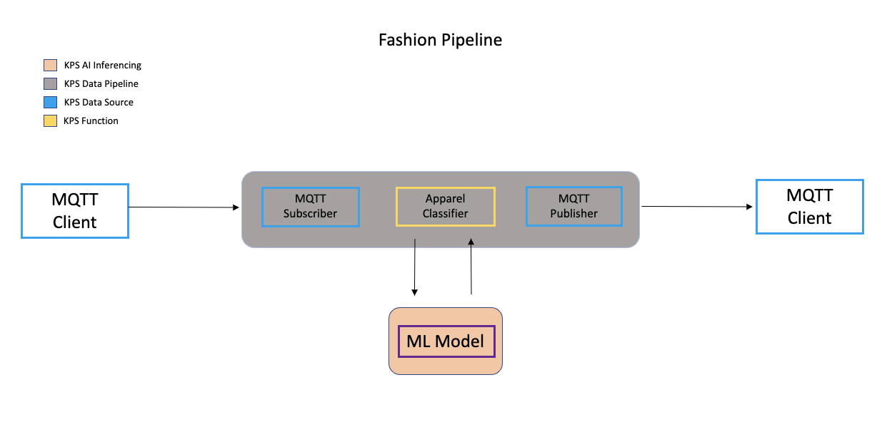
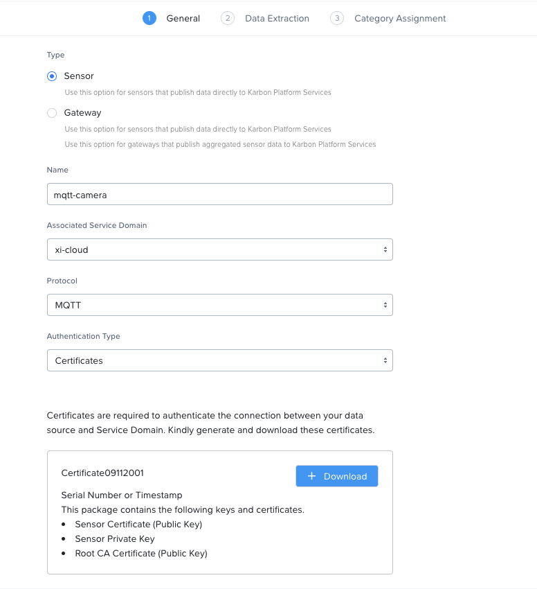
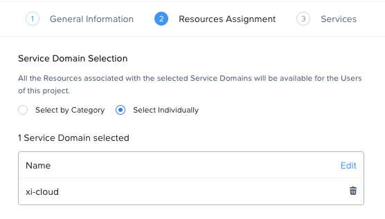
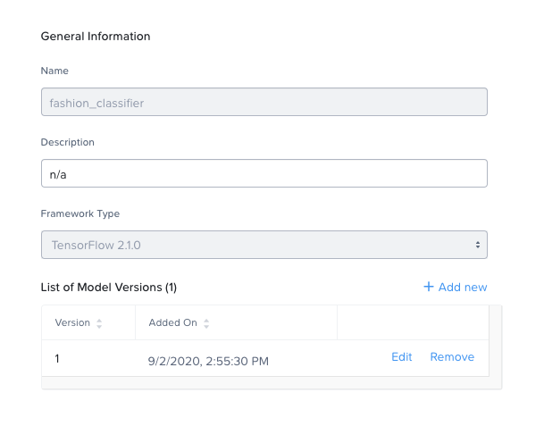
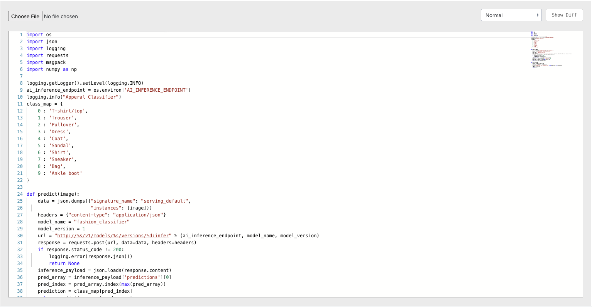
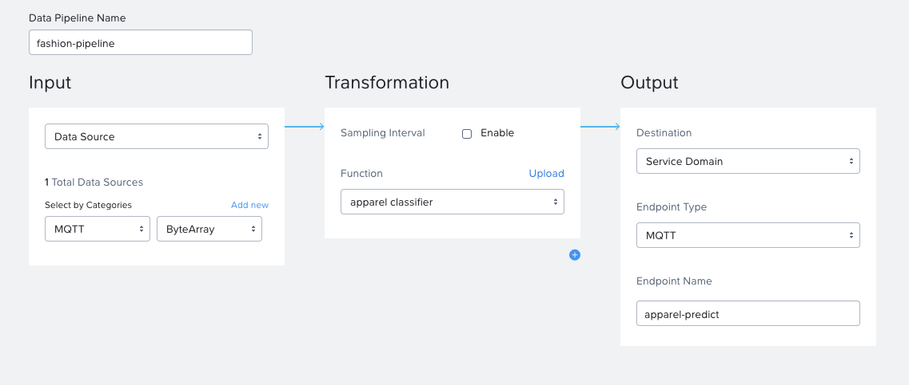
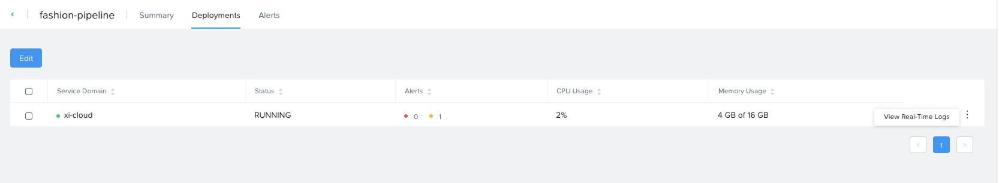

# Deploying Pipelines for Machine Inference on Karbon Platform Services

Karbon Platform Services (KPS) is a Kubernetes based multi-cloud PaaS that enables rapid development and deployment of microservices-based applications ranging from simple stateful containerized applications to complex AI, IoT and hybrid applications across any cloud.

This tutorial will guide you through the deployment of a sample Data Pipline utilizing the KPS AI Inferencing Service. The application is deployed to a KPS Service Domain for execution. This tutorial assumes your Service Domain has already been deployed using steps from the <a href="https://portal.nutanix.com/page/documents/details?targetId=Karbon-Platform-Services-Admin-Guide:ks-service-domain-manage-c.html">Karbon Platform Services Admin Guide</a> and that direct network connectivity between the Service Domain and your local workspace is configured (to view sample output). Access to the Admin Guide is provided via the My Nutanix Portal and requires an account to login.

## Objectives

* Create an MQTT data source to ingest images.
    * Create an MQTT client to mimic real data source.
* Deploy a [Tensorflow](https://www.tensorflow.org/) model using the KPS AI Inferencing Service.
* Create a function to make an inference request using the ingested images.
* Create a Data Pipeline to ingest the images, execute the function, and output the results. 

## Design



## Set Up

This section will show you how to set up your workspace on your local machine, so you can perform tasks like creating an MQTT client and training an ML model.

### Project Structure

```bash
├── workspace
│   ├── fashion_classifier.zip
│   ├── mqtt_client.py
│   ├── model_trainer.py
│   ├── apparel_classifier.py
│   ├── requirements.txt
│   └── certs/
```

### Requirements

This guide will require python3 as well as a few additional python libraries. Download <a href="requirements.txt" download>requirements.txt</a> and install the requirements via the *pip* installer.
```bash
pip3 install -r requirements.txt
```

## MQTT Data Source

MQTT is an OASIS standard messaging protocol for the Internet of Things (IoT). It is designed as an extremely lightweight publish/subscribe messaging transport that is ideal for connecting remote devices with a small code footprint and minimal network bandwidth. MQTT today is used in a wide variety of industries, such as automotive, manufacturing, telecommunications, oil and gas, etc.

## Accessing Karbon Platform Services

1. Open https://my.nutanix.com/ in your browser. If you don't already have a My Nutanix account, follow steps to create one.
1. Scroll to the Cloud Services section and click Launch to access the Karbon Platform Services Cloud Management Console.

   At this point you should have a dashboard with a default User (you), Project, Category.

### MQTT in KPS

1. After logging into the Karbon Platform Services Cloud Management Console, proceed to **Categories**. 
	* Here you'll create Categories for your data sources to be mapped to future Data Pipelines. 
	* For the purpose of this guide we'll create a category called ```MQTT``` with a value called ```ByteArray```. 
1. Proceed to **Data Sources and IoT Sensors** and choose *Add Data Source*.
1. Enter **mqtt-camera** in the Name field.
1. In the Associated Service Domain dropdown, choose your Service Domain.
1. In the Protocol dropdown, choose **MQTT**.
1. Click **\+Generate Certificates**, then click **\+Download** to save the zip file in a location for reference in a future step.
1. Rename the certificates as follows for simplicity.
	- CA certificate &#8594; ```ca.crt```
	- Client certificate &#8594; ```client.crt```
	- Client key &#8594; ```client.key```
   
   

1. On the Data Extraction page, click **Add New Field**, enter **apparel_images** in the Name field, enter **apparel_images** into the MQTT Topic field, click the round, blue :heavy_check_mark: , then click **Next**. 
1. Click inside the first (left) **Attribute dropdown** of the newly added category assignment and choose **MQTT**.
1. Click inside the second (right) **Attribute dropdown** of the newly added category assignment and choose **ByteArray**.
1. Click **Add**.
	* The MQTT data source can now publish data to Kubernetes Apps and Data Pipelines. 

### MQTT Client

You can create a client to send data to the data source you just created in Karbon Platform Services. For the purpose of this guide, we will be implementing our client in ```mqtt_client.py```. 

1. Move the downloaded certificates from the previous step in the ```certs``` directory in your workspace. Your workspace structure should now look as follows:

```bash
├── workspace
│   ├── fashion_classifier.zip
|	├── mqtt_client.py
│   ├── model_trainer.py
│   ├── apparel_classifier.py
│   ├── requirements.txt
│   └── certs/
│       ├── ca.crt
│       ├── client.crt
│       └── client.key
```

<details>
  <summary>Click to expand mqtt_client.py</summary>

```python
import ssl
import time
import random
import msgpack
from tensorflow import keras
import paho.mqtt.client as mqttClient


def on_connect(client, userdata, flags, rc):
	if rc == 0:
		print("Connected to broker")
		global Connected                #Use global variable
		Connected = True                #Signal connection 
	else:
		print("Connection failed")

def on_publish(client, userdata, result):
	print("Published!")

def on_message(client, userdata, message):
	print("New message received!")
	print("Topic:", message.topic)
	print("Message:", message)


def main():
	global Connected
	Connected = False
	# IP address of the edge. Modify this.
	broker_address= "<service domain ip>"
	port = 1883
	# NOTE: For data pipelines to receive MQTT messages, topic should
	#       be the same as that specified when creating the MQTT datasource.
	input_topic = "apparel_images"
	output_topic = "apparel-predict"
	client = mqttClient.Client()
	# Set callbacks for connection event, publish event and message receive event
	client.on_connect = on_connect
	client.on_publish = on_publish
	client.on_message = on_message
	client.tls_set(ca_certs="certs/ca.crt", certfile="certs/client.crt", keyfile="certs/client.key", cert_reqs=ssl.CERT_REQUIRED, tls_version=ssl.PROTOCOL_TLSv1_2, ciphers=None)
	# Set this to ignore hostname only. TLS is still valid with this setting.
	client.tls_insecure_set(True)
	client.connect(broker_address, port=port)
	client.subscribe(output_topic)
	client.loop_start()

	# Wait for connection
	while Connected != True:
		print("Connecting...")
		time.sleep(1)

	fashion_mnist = keras.datasets.fashion_mnist
	(images, image_labels), (test, labels) = fashion_mnist.load_data()

	# scale the values to 0.0 to 1.0
	images = images / 255.0
	# reshape for feeding into the model
	images = images.reshape(images.shape[0], 28, 28, 1)

	for i in range(10):
		print(f'\nCounter: {i+1}')
		img = random.choice(images)
		print(img.shape)
		payload ={}
		payload['image'] = img.tolist()
		payload['dtype'] = str(images.dtype)
		payload['height'] = 28
		payload['width'] = 28
		try:
			client.publish(input_topic, msgpack.packb(payload))
			time.sleep(5)
		except KeyboardInterrupt:
			client.disconnect()
			client.loop_stop()

if __name__ == "__main__":
	 main()
```

</details>

**Note**: Make sure to fill in your *service domain ip* before executing the script. 
* This client will use [Keras Fashion MNIST dataset](https://keras.io/api/datasets/fashion_mnist/) to send images of different types of apparel to the MQTT data source topic configured above.

## Deploying an ML Model to Karbon Platform Services

This section will show how to deploy a machine learning model using the AI Inferencing Service in KPS. The AI Inferencing Service provides ML model management and an AI Inferencing runtime (pooled though an abstraction of GPUs and hardware accelerators). For the purposed of this guide, we will be using the [Tensorflow](https://www.tensorflow.org/) Framework.

TensorFlow is a free and open-source software library for dataflow and differentiable programming across a range of tasks. It is a symbolic math library, and is also used for machine learning applications such as neural networks.

### Creating a Project

In KPS, Projects are used to segment resources such as Functions, Data Pipelines, and other services so that only assigned users can view and modify them. This allows different departments or teams to utilize shared Service Domains or cloud resources without interfering with each other's applications or business logic.

As part of this tutorial, you’ll create a new Project to deploy your sample Application.

1. After logging into the Karbon Platform Services Cloud Management Console, proceed to the Projects section. 
1. Create a project, name it Fashion Project, add yourself as a User, and then click **Next**. 

   

1. On the Resources Assignment dialog, select the same Service Domain chosen to create your Data Source and click **Next**. 
   
   KPS has the ability to natively send to several public cloud services such as AWS S3, or GCP Cloud Datastore. For this tutorial, Cloud Profile Selection can be left blank because no cloud resources will be used.

   KPS can run Kubernetes Apps with images stored in public or private registries. Private registries can be accessed by creating a KPS Container Registry Profile to store required access information. Because this tutorial utilizes containers hosted in a public registry, Container Registry Selection can be left blank.
   
1. In the final section, no extra services are required.

### Deploying a Tensorflow Model on Karbon Platform Services

The KPS AI Inferencing Service supports deployment of Tensorflow models saved in SavedModel format. A sample model is provided for the purposes of this turtorial. You may also choose to train your own model (see below).

1. In a new browser tab or window, download the compressed zip file labeled <a href="fashion_classifier.zip" download>fashion_classifier.zip</a>. This file contains the sample model compressed in SavedModel format. 
1. Switch context to Fashion Project in the Project pulldown, then click **AI Inferencing**. 
1. Click **\+Add Model** to create a new model. 
1. Enter **fashion_classifier** in the Name field.
1. Enter your choice of description in the Description field, then click **Add**.
1. Choose **Tensorflow 2.1.0** from the Framework Type dropdown.
1. Click **\+Add Version**, then enter **1** in the ML Model Version field.
1. Click **Choose File** and browse to the fashion_classifier.zip file downloaded above.
1. Enter your choice of description in the Version Information field, and click **Upload**.

   

1. Click **Done**.

<details>
  <summary>Expand for steps to train your own model</summary>
  
### Training a Tensorflow Model

To train a machine learning model to deploy on Karbon Platform Services. 

The following script will perform two key tasks
  * Train a convolutional neural network to classify images of different classes of apparel
  * Save the model in Tensorflow SavedModel format.

*model_trainer.py*
```python
import tensorflow as tf
from tensorflow import keras

# Helper library
import numpy as np

# dataset used to train model
fashion_mnist = keras.datasets.fashion_mnist
(train_images, train_labels), (test_images, test_labels) = fashion_mnist.load_data()

# scale the values to 0.0 to 1.0
train_images = train_images / 255.0
test_images = test_images / 255.0

# reshape for feeding into the model
train_images = train_images.reshape(train_images.shape[0], 28, 28, 1)
test_images = test_images.reshape(test_images.shape[0], 28, 28, 1)

# class labels
class_names = ['T-shirt/top', 'Trouser', 'Pullover', 'Dress', 'Coat',
               'Sandal', 'Shirt', 'Sneaker', 'Bag', 'Ankle boot']

print('\ntrain_images.shape: {}, of {}'.format(train_images.shape, train_images.dtype))
print('test_images.shape: {}, of {}'.format(test_images.shape, test_images.dtype))

# neural network architecture
model = keras.Sequential([
  keras.layers.Conv2D(input_shape=(28,28,1), filters=8, kernel_size=3, 
                      strides=2, activation='relu', name='Conv1'),
  keras.layers.Flatten(),
  keras.layers.Dense(10, activation=tf.nn.softmax, name='Softmax')
])
model.summary()

testing = False
epochs = 5

model.compile(optimizer='adam', 
              loss='sparse_categorical_crossentropy',
              metrics=['accuracy'])
model.fit(train_images, train_labels, epochs=epochs)

test_loss, test_acc = model.evaluate(test_images, test_labels)
print('\nTest accuracy: {}'.format(test_acc))

tf.saved_model.save(model, 'fashion_classifier')
print('\nSaved model:')
```

**Note**: Make sure all the requirements are installed and then run the script.
```bash
Model: "sequential"
_________________________________________________________________
Layer (type)                 Output Shape              Param #   
=================================================================
Conv1 (Conv2D)               (None, 13, 13, 8)         80        
_________________________________________________________________
flatten (Flatten)            (None, 1352)              0         
_________________________________________________________________
Softmax (Dense)              (None, 10)                13530     
=================================================================
Total params: 13,610
Trainable params: 13,610
Non-trainable params: 0
_________________________________________________________________
Train on 60000 samples
Epoch 1/5
60000/60000 [==============================] - 3s 45us/sample - loss: 0.5303 - accuracy: 0.8138
Epoch 2/5
60000/60000 [==============================] - 3s 42us/sample - loss: 0.3879 - accuracy: 0.8646
Epoch 3/5
60000/60000 [==============================] - 3s 43us/sample - loss: 0.3515 - accuracy: 0.8754
Epoch 4/5
60000/60000 [==============================] - 3s 42us/sample - loss: 0.3321 - accuracy: 0.8818
Epoch 5/5
60000/60000 [==============================] - 3s 42us/sample - loss: 0.3195 - accuracy: 0.8855
10000/10000 [==============================] - 0s 25us/sample - loss: 0.3540 - accuracy: 0.8731

Test accuracy: 0.8730999827384949
```

You should now have a directory in your workspace called ```fashion_classifier``` with the following directory structure:
```bash
├── fashion_classifier
│   ├── assets/
│   ├── variables/
│       ├── variables.data-00000-of-00001
│       └── variables.index
│   └── saved_model.pb
```

1. Recursively *zip* all the contents of the SavedModel directory. 
	* The AI Inferencing service requires a compressed zip of the objects to be uploaded.
```bash
zip fashion_classifier.zip fashion_classifier/* -r
```

</details>

## Creating a Data Pipeline

Data Pipelines in Karbon Platform Services allow you to transform data by injecting your own code. In this tutorial, this Functions-as-a-Service functionality is used to run inference using the machine learning models created above.

### Implementing a KPS Function

Karbon Platform Services Functions may be written in well known software languages most commonly used for data oriented tasks such as aggregation, correlation, and machine learning. These currently include Python, Go, and Node.js. This allows developers to re-use existing code, or quickly write new logic utilizing standard libraries, all without the burden of learning a new platform or language.  

The following function will perform a few key tasks:
* Unpack the input received from the MQTT data source
* Run inference on the input image
* Log the predicted class and confidence
* Publish the message back to an MQTT topic for consumption by other applications

<details>
  <summary>Click to expand apparel_classifier.py</summary>

```python
import os
import json
import logging
import requests
import msgpack
import numpy as np

logging.getLogger().setLevel(logging.INFO)
ai_inference_endpoint = os.environ['AI_INFERENCE_ENDPOINT']
logging.info("Apperal Classifier")

# class labels 
class_map = {
        0 : 'T-shirt/top', 
        1 : 'Trouser', 
        2 : 'Pullover', 
        3 : 'Dress', 
        4 : 'Coat',
        5 : 'Sandal', 
        6 : 'Shirt', 
        7 : 'Sneaker', 
        8 : 'Bag', 
        9 : 'Ankle boot'
}

def predict(image):
    data = json.dumps({"signature_name": "serving_default",
                       "instances": [image]})
    headers = {"content-type": "application/json"}
    model_name = "fashion_classifier"
    model_version = 1
    url = "http://%s/v1/models/%s/versions/%d:infer" % (ai_inference_endpoint, model_name, model_version)
    response = requests.post(url, data=data, headers=headers)
    if response.status_code != 200:
        logging.error(response.json())
        return None
    inference_payload = json.loads(response.content)
    pred_array = inference_payload['predictions'][0]
    pred_index = pred_array.index(max(pred_array))
    prediction = class_map[pred_index]
    return prediction, max(pred_array)

def main(ctx, msg):
	payload = msgpack.unpackb(msg)
	img = payload['image']
	prediction, confidence = predict(img)
	output = "Prediction: {}, Confidence: {}".format(prediction, str(confidence))
	logging.info(output)
	ctx.send(msg)
	return
```

</details>

1. In a new browser tab or window, download the compressed zip file labeled <a href="apparel_classifier.py" download>apparel_classifier.py</a>. This file contains the python script above. 
1. Continuing in the Fashion Project context, click **Functions and Data Pipelines**.
1. Click **Functions** in the top menu bar, then click **\+Add Function**.
1. Enter **aparrel classifier** in the Name field, then choose **Python** and **Tensorflow Python** from the Language and Runtime Environment dropdowns, respectively.
1. Click **Choose File**,browse to the file to apparel_classifier.py script saved above, then click **Create**. 

   

### Configuring a Data Pipeline

1. Click **Data Pipelines** in the top menu bar, then click **\+Create Data Pipeline**.
1. Complete the following fields to build the pipeline:

   - **Data Pipeline Name** - fashion-pipeline
   - Select **\+ Add Data Source > Data Source**
     - **Category** - MQTT
     - **Value** - ByteArray
   - Select **\+ Add Function > apparel classifier**
   - Select **\+ Add Destination > Publish to Service Domain**
   - **Endpoint Type** - MQTT
   - **Endpoint Name** - apparel-predict
     * The Endpoint Name is the MQTT topic output is published on.

   

1. Click **Create**.

   At this point, your Data Source, Function, and Data Pipeline are all configured and automatically deployed by Karbon Platform Services onto your Service Domain based on the earlier assignment within the Fashion Project.

   In this tutorial you’re outputting Data Pipeline results to MQTT, but Karbon Platform Services has native capability to output in many ways.
   From the Destination dropdown you’ll notice the ability to output to your Service Domain, or to an External Cloud.

   Here’s a breakdown of options and typical use cases:

   - **Service Domain**
       - **Kafka** - real-time streaming between Service Domain local applications
       - **MQTT** - real-time streaming devices (actuators or other edge devices)
       - **Realtime Data Stream** - real-time streaming between KPS Data Pipelines
       - **Data Interface** - real-time stream between KPS Service Domains and custom applications and protocols
   - **External Cloud**
      - **AWS**
           - **Kinesis** - real-time streaming for large volumes of data
           - **SQS** - sending messages via web service applications
           - **S3** - simple file storage
      - **Azure**
           - **Blob Storage** - simple file storage
      - **GCP**
           - **PubSub** - real-time streaming
           - **CloudDatastore** - highly scalable NoSQL database
		   - **CloudStroage** - simple file storage

## Verifying Expected Output

1. From your local workspace run the mqtt_client.py script to send data through the data pipeline.
	*Client Output:*
	```bash
	Connecting...
	Connected to broker

	Counter: 1
	(28, 28, 1)
	Published!
	New message received!
	Topic: apparel-predict
	Message: <paho.mqtt.client.MQTTMessage object at 0x1305c33d0>

	Counter: 2
	(28, 28, 1)
	Published!
	New message received!
	Topic: apparel-predict
	Message: <paho.mqtt.client.MQTTMessage object at 0x1305c33d0>
	...
	```
1. Click **Data Pipelines** in the top menu bar, then click on the **fashion-pipeline** just created.
1. From the top menu bar, click **Deployments**.
   * Your Service Domain should be listed.
1. Click the tasks menu (three dots on right side) for your Service Domain, then click **View Real-Time Logs**.

   

1. Click the **aparrel classifier** tab.
   
   Logging output like the below should be present.

	```bash
	[2020-09-02 23:54:25,387 root INFO] Subscribe to input
	[2020-09-02 23:54:25,388 root INFO] Publish to apparel-predict
	[2020-09-02 23:54:25,390 root INFO] Load function from: /tmp/workspace/main.py
	[2020-09-02 23:54:25,481 root INFO] Apperal Classifier
	[2020-09-02 23:54:25,481 root INFO] Load config: {}
	[2020-09-02 23:54:47,999 root INFO] Prediction: Sandal, Confidence: 0.981710374
	[2020-09-02 23:54:52,954 root INFO] Prediction: Bag, Confidence: 0.975674689
	[2020-09-02 23:54:57,962 root INFO] Prediction: Trouser, Confidence: 0.9997558
	[2020-09-02 23:55:02,970 root INFO] Prediction: Shirt, Confidence: 0.747512937
	[2020-09-02 23:55:07,964 root INFO] Prediction: Bag, Confidence: 0.999879479
	[2020-09-02 23:55:12,974 root INFO] Prediction: Shirt, Confidence: 0.71217078
	[2020-09-02 23:55:17,971 root INFO] Prediction: Trouser, Confidence: 0.999445498
	[2020-09-02 23:55:22,981 root INFO] Prediction: Trouser, Confidence: 0.999979496
	[2020-09-02 23:55:27,993 root INFO] Prediction: Trouser, Confidence: 0.999996781
	[2020-09-02 23:55:32,985 root INFO] Prediction: Bag, Confidence: 0.999730408
	```
	* **Note**: The predictions in your logs will differ since the images being published are random.

Congratulations! You've successfully deployed a sample Data Pipline utilizing the AI Inferencing Service using KPS.

## Takeaways

* Karbon Platform Services easily inputs and outputs data using MQTT Data Sources.
* KPS makes it easy to deploy and manage a machine learning model for increased business intelligence.
* KPS supports serverless functions in well known software languages allowing developers to re-use existing code, or quickly write new logic utilizing standard libraries, all without the burden of learning a new platform or language.
* KPS makes debugging easy by providing access to realtime logs of deployed apps and data pipelines directly from the cloud based management console.
* KPS allows deployment of Data Pipelines and their Functions at scale using a cloud-based SaaS control plane.


